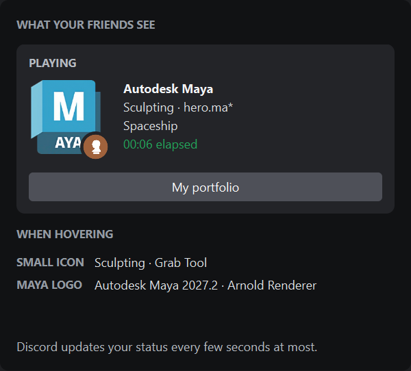
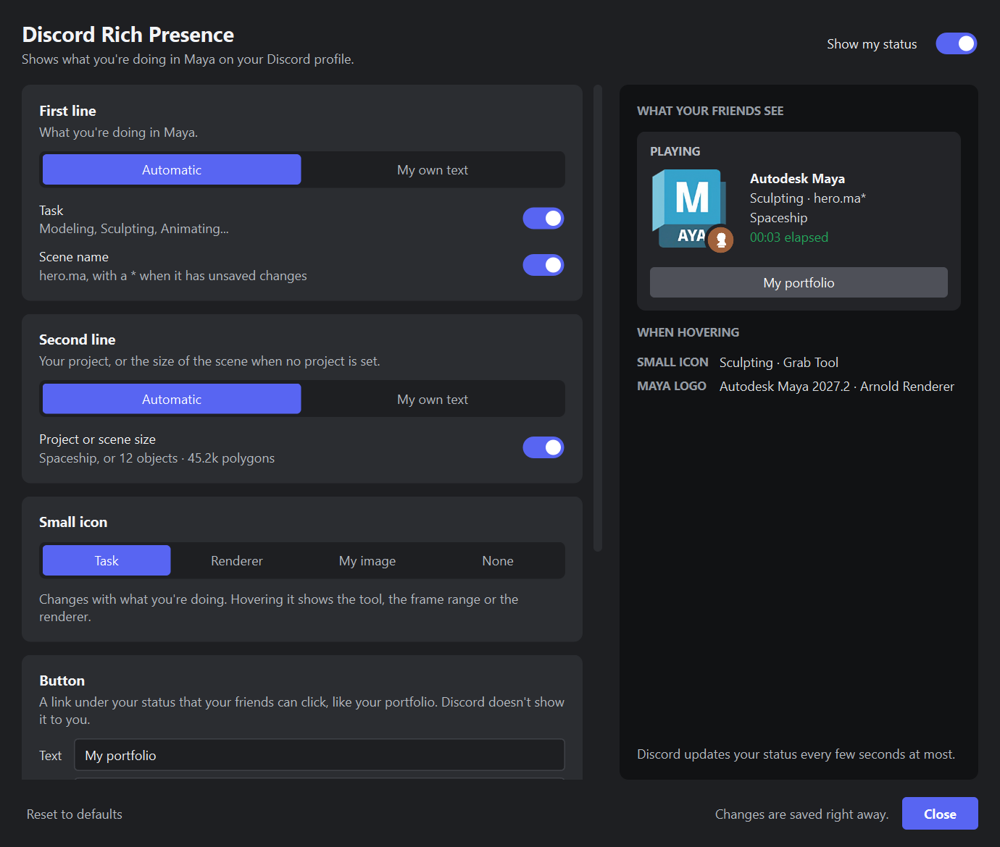
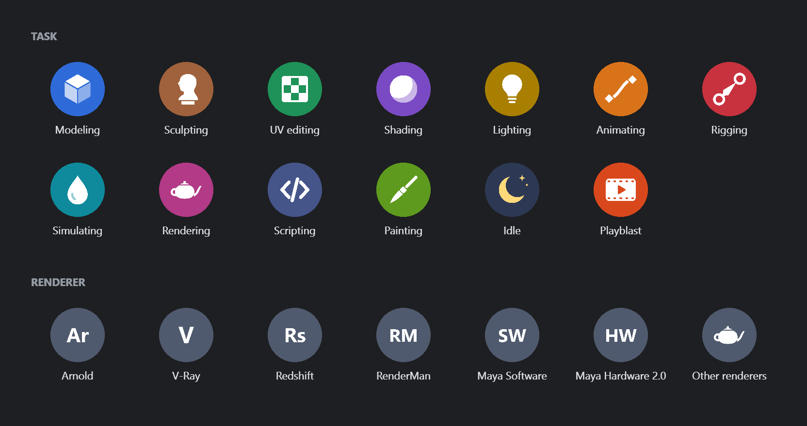

# Maya Better Presence

Discord Rich Presence for Autodesk Maya. Shows what you are doing in Maya in your Discord status: the current task, the scene, the project and how long you've been working.

  
   
  <em>Your status, as the settings window previews it.</em>

> An improved version of [Discord-Rich-Presence-For-Maya](https://github.com/aronamao/Discord-Rich-Presence-For-Maya) by Aron Amao, with new features and Maya 2027 support.

> [!WARNING]
> **Maya 2023 to 2026:** this improved version has not been tested on these versions yet. Please report any problem by [opening an issue](https://github.com/TheUnknownMurda/Maya-Better-Presence/issues) so I can fix it.
> In the meantime, you can use the [original plug-in](https://github.com/aronamao/Discord-Rich-Presence-For-Maya/releases/latest), which is tested and works on Maya 2023 to 2026. [Uninstall](#uninstalling) this version first.

## What's new compared to the original

- **Maya 2027** support, on top of 2023 to 2026.
- **Current task** shown: Modeling, Sculpting, UV editing, Animating, Rendering…
- **Scene statistics** ("12 objects · 45.2k polygons") when no project is set.
- **Unsaved changes** marked with a `*` after the scene name.
- **Custom text** for each line, with placeholders.
- **Idle detection**: shows "Idle" or hides your status, and the time away isn't counted.
- **Button** with a link, to your portfolio for example.
- **Maya logo**, with the Maya version and renderer on hover.
- **Small icon** on the Maya logo: your current task, your renderer or your own image, with one more detail on hover
  (the tool, the frame range, the renderer's version...).
- **Settings window** with a live preview of what your friends see, where every change applies right away.
- **Show My Status in Discord**, in the Rich Presence menu, to hide your status in one click.
- **One-click install** with no restart, and updates that keep your settings.
- **Fixes**: names with accents, "Save As", settings turning themselves back on, crash when reloading the plug-in, install failing when the Windows user name contains an accent.

## Requirements

- Windows
- Maya 2023, 2024, 2025, 2026 or 2027
- The **Discord desktop app**, running. Discord in a web browser doesn't work.

## Installing

1. From the [latest release](https://github.com/TheUnknownMurda/Maya-Better-Presence/releases/latest), download the zip for your Maya version
   (`...-Maya2027.zip` for Maya 2027, for example), or the zip without a Maya version in its name, which contains every version.
   Then **extract it**: right-click > **Extract All**. Don't run the installer from inside the zip.
2. Open Maya.
3. Drag and drop `installer.py` from the extracted folder onto the Maya window, over the 3D view.
4. Click **Install**.
5. Maya shows the **Untrusted Plugin Loading** warning: tick **Apply to all plugins in this location**, then click **Allow**.
   This warning is normal: Maya shows it for every plug-in not made by Autodesk.
6. Click **Close**.

Your status shows up in Discord within a few seconds. From then on, the plug-in loads by itself every time Maya starts.

## Updating

1. Extract the new version.
2. In Maya, drag and drop `installer.py` and click **Install**.
3. Restart Maya when the installer asks you to.

Your settings are kept. If you use several versions of Maya, installing the zip of one version
doesn't remove the others.

## Settings

**Rich Presence > Settings**, in Maya's menu bar. The window shows what your friends see, updated live
from Maya, and every change is applied and saved right away. You can keep it open while you work.

  

| Setting | What it does |
|---|---|
| **Show my status** | Shows or hides your status in Discord. Also in the Rich Presence menu: **Show My Status in Discord**. |
| **First line** | Automatic: the task and the scene name, each with its switch. Or your own text. |
| **Second line** | Automatic: the project, or the size of the scene when no project is set. Or your own text. |
| **Small icon** | The small round icon on the Maya logo: the current task, the renderer, your own image (a link to a PNG or JPG, with a text shown on hover), or none. |
| **Button** | Adds a button with a link. Your friends see it, but Discord doesn't show it to you. |
| **When you're away** | After the chosen time without using Maya: shows "Idle", hides your status, or does nothing. The timer pauses. |
| **Timer** | Restarts the timer when a scene is opened. |

In your own text, the **Task**, **Scene**, **Project** and **Stats** buttons insert these placeholders:

| Placeholder | Replaced by |
|---|---|
| `{task}` | the current task ("Idle" while idle) |
| `{scene}` | the scene name |
| `{project}` | the project name |
| `{stats}` | the scene statistics |

Example: `{task} on {scene}` shows "Modeling on hero.ma".

**To hide your status**, uncheck **Rich Presence > Show My Status in Discord**.

### Small icons

The icon on the Maya logo changes with what you're doing, or shows your renderer. Hovering it in Discord shows one more detail:
the tool, the frame range and fps, or the renderer's version.

  

## Uninstalling

1. Close Maya.
2. Open the `Documents\maya\modules` folder.
3. Delete the `DRPForMaya.mod` file and the `DRPForMaya` folder.

## Troubleshooting

| Problem | Solution |
|---|---|
| My status doesn't show up | Open the Discord desktop app. In Discord, make sure sharing your activity is turned on in **User Settings > Activity Privacy**. |
| "Could not find the 'module' folder" | The zip wasn't extracted. Extract it, then drag `installer.py` from the extracted folder. |
| "Maya 20XX is not supported yet" | This version of Maya isn't supported. |
| I clicked **Deny** | Run the installer again and click **Allow**. |
| A placeholder is shown as is, like `{task]` | Check the spelling and the braces: `{task}`. |

## For developers

- `src/`: the plug-in's C++ code. `module/`: what gets installed in Maya. `installer.py`: the installer.
- **Building** (Visual Studio 2022 with the C++ tools):
  - `build.bat 2027` builds for the Maya 2027 installed on the machine;
  - `build.bat 2025 C:\maya_devkits\2025\devkitBase` builds with a [Maya devkit](https://aps.autodesk.com/developer/overview/maya).

  The built plug-in is copied to `module/plug-ins/<version>`. The original CMake files are still there, but haven't been tested with this version.
- **Changing the wording** of the task and statistics, or how tasks are detected: edit `module/scripts/RichPresenceUI/context.py`, no rebuild needed.
- **Small icons**: `assets/icons`. Edit the `.svg` files, then run `mayapy assets/icons/export_icons.py` to update the `.png` files.
  Discord downloads the `.png` files from this GitHub repository (`ICON_URL` in `context.py`), so push them before releasing,
  and raise `v=` in `ICON_URL` after changing an icon so Discord doesn't keep the old one.
- **Distributing**: `python package.py 2.1` builds the release zips in `dist/`: one with every Maya version,
  and one per Maya version. Attach them to a GitHub release.

## Credits

- Original plug-in: [Aron Amao](https://github.com/aronamao/Discord-Rich-Presence-For-Maya)
- Uses the [Discord Social SDK](https://discord.com/developers/docs/discord-social-sdk/overview)
